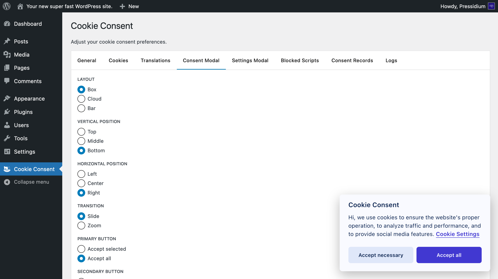
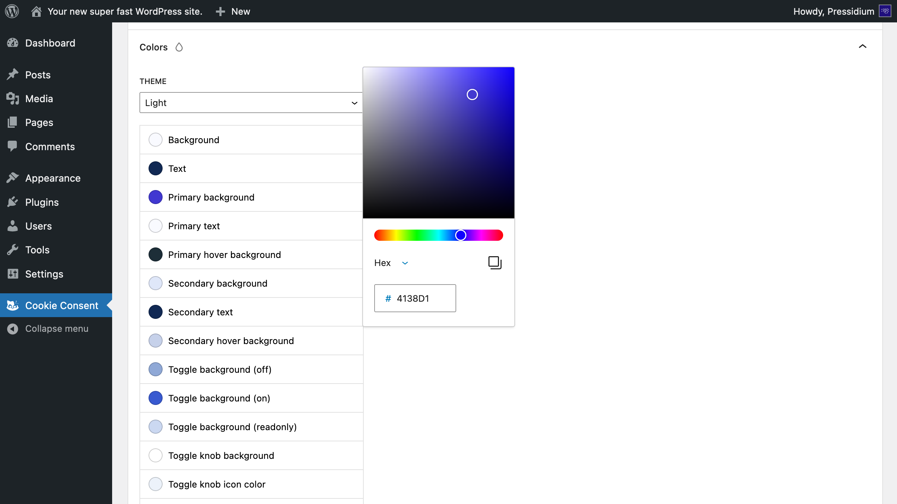
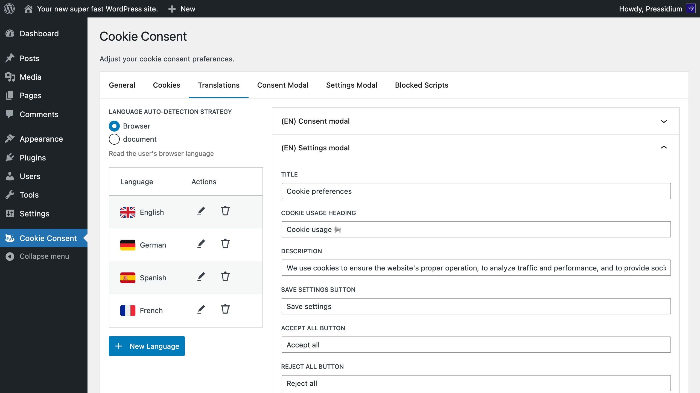
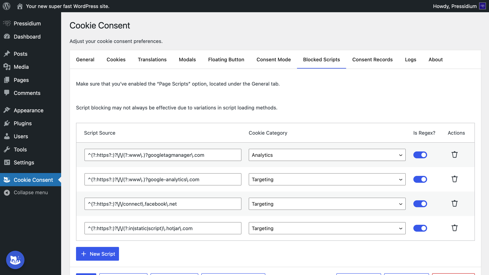
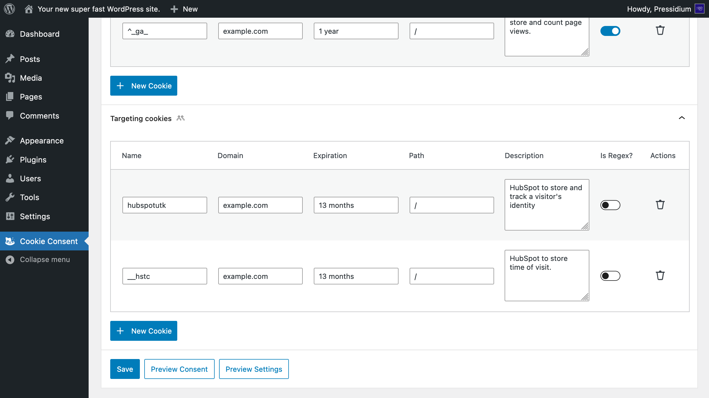
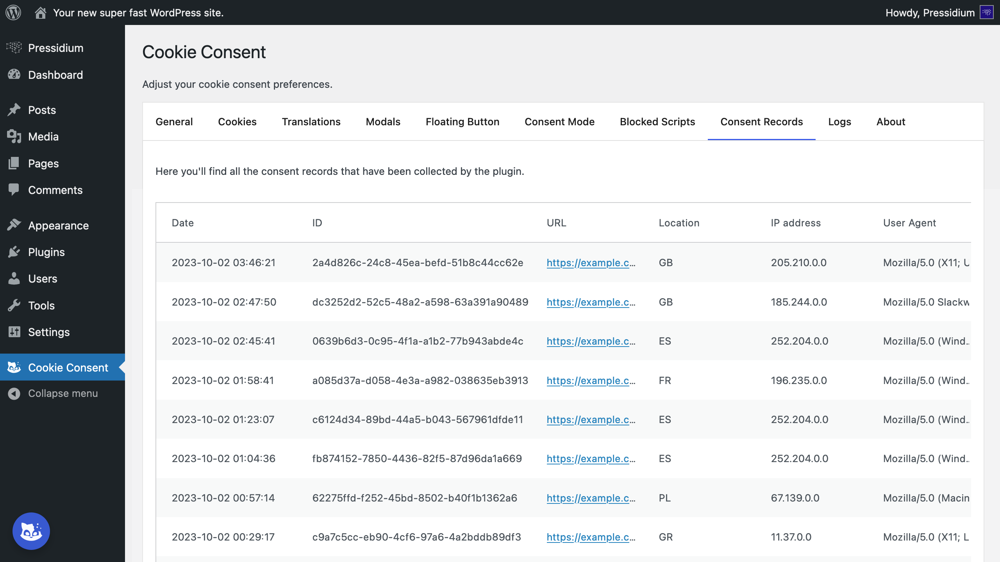
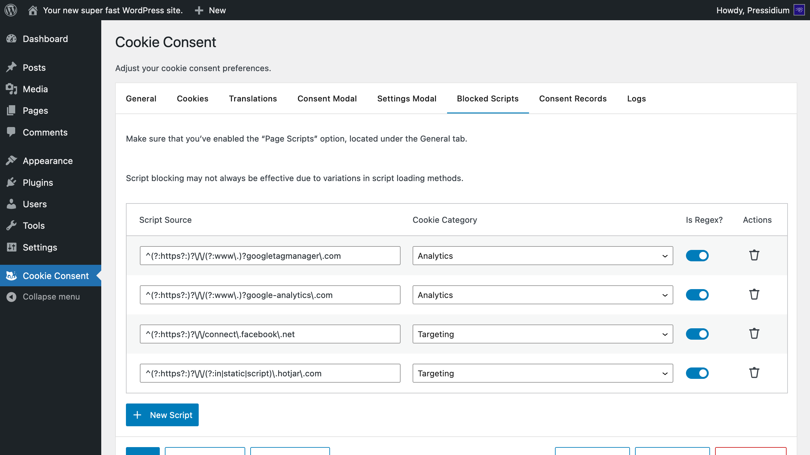
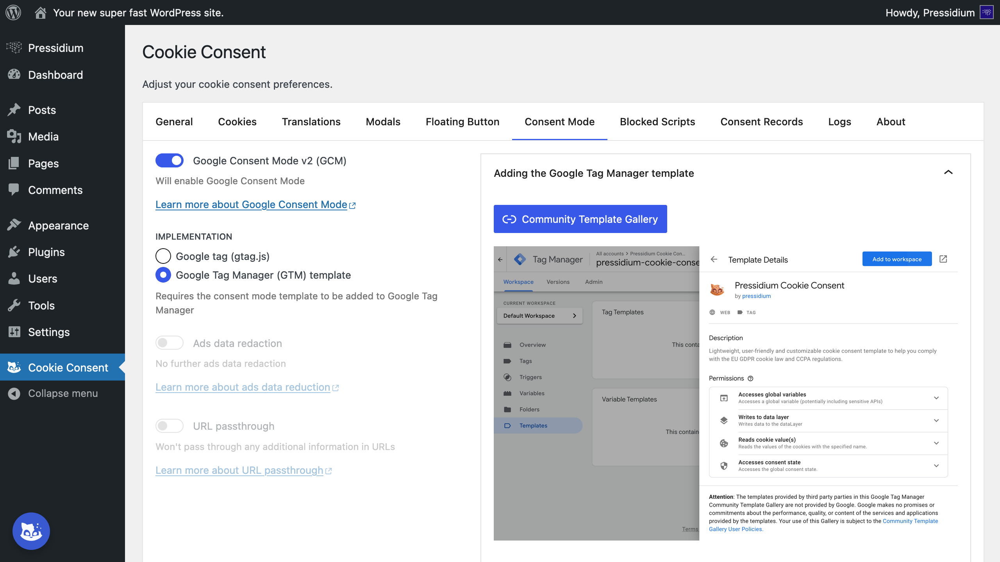
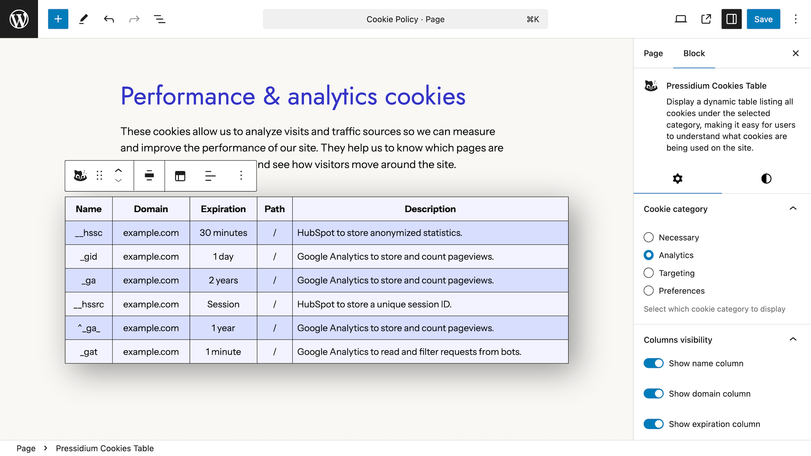

<p align="center">
    
</p>

# Pressidium Cookie Consent

[](https://wordpress.org/plugins/pressidium-cookie-consent/)
[](https://wordpress.org/plugins/pressidium-cookie-consent/)
[](https://wordpress.org/plugins/pressidium-cookie-consent/)
[](https://wordpress.org/plugins/pressidium-cookie-consent/)

🍪 Pressidium Cookie Consent makes it easy to add a stylish, customizable cookie consent banner to your website and conditionally load third-party scripts (preferences, analytics, targeting, etc.) based on the user-selected preferences to help you comply with EU GDPR cookie law, CCPA, and similar regulations.



## Table of Contents

* [Setup](#setup)
* [Features](#features)
* [Credits](#credits)
* [License](#license)
* [About Pressidium](#about-pressidium)

## Setup

1. Install Composer dependencies

    ```bash
    composer install
    ```

2. Install npm dependencies

    ```bash
    npm install
    ```

3. Build the plugin

    ```bash
    npm run build
    ```

4. Upload the entire `pressidium-cookie-consent` folder to the `wp-content/plugins/` directory

5. Activate the plugin through the “Plugins” menu in WordPress

## Features

### ⚙️ Fully customizable



Easily modify the cookie consent banner and settings modal text. Pick one of the built-in color presets to match your website’s aesthetic, or adjust the color of individual components via our convenient color picker. Choose from a variety of layouts, positions, and transitions directly from the WordPress dashboard.

### 🪶 Lightweight

The plugin is built on top of the Cookie Consent JS library by Orest Bida, a standalone vanilla JavaScript library with no third-party dependencies, that loads blazingly fast and won’t slow down your website.

### ♿ Accessible

An a11y friendly plugin — fully accessible and WAI-ARIA compliant.

### 🌐 Translatable



Modify any text in the cookie consent banner and settings modal, and provide translations. Choose the language auto-detection strategy you prefer — either  read the user’s browser language or read the markup of the current page to identify its primary language.

### 📱 Responsive

Fully responsive and mobile-friendly cookie consent banner and settings modal.

### 🙅 Block scripts



Control which scripts are loaded based on the user’s preferences. List the URLs of the scripts you’d like to block (both exact matches and regular expressions are supported) and prevent them from running until the user has given consent.

### 🧹 Auto-clear cookies



Automatically delete cookies when a user opts-out of a specific category inside cookie settings.

### ✋ Force consent

Block the user from interacting with the page until they consent to your cookie policy.

### 🔁 Re-consent

Ask users to consent again when you update your cookie policy.

### 📝️ Consent records



Record user consents to be able to provide proof of consent for auditing purposes.

### 🎛️ Floating settings button



Add a floating settings button to your website that allows users to change their cookie preferences at any time.

### 🤖 Hide from bots

Automatically parse the user agent to detect bots, crawlers, and webdrivers. If one is detected, you have the option to hide the cookie consent banner from them.

### 🧩 Google Consent Mode (GCM) integration



Integrate with Google Consent Mode (GCM) to adjust how Google tags behave based on the user’s consent preferences. Supports both Google tag (gtag.js) and Google Tag Manager (GTM) implementations.

### ✨ AI integration


Integrate with AI to generate translations and cookie descriptions. Supports both GPT and Gemini.

### 🧱 Block for the WordPress Block Editor



Add the **Pressidium Cookies Table** block for the Block Editor to display a dynamic table listing all cookies under the selected category, making it easy for users to understand what cookies are being used on the site.

### ⌨️ Control it programmatically

Programmatically control the plugin. Conditionally show/hide the cookie consent banner and/or the settings modal, accept one (or more) cookie categories, erase cookies, load previously blocked scripts, etc.

## Credits

- Built on top of the amazing [Cookie Consent](https://github.com/orestbida/cookieconsent) JS library by [Orest Bida](https://github.com/orestbida) (licensed under MIT)
- Flag SVGs by [blade-flags](https://github.com/MohmmedAshraf/blade-flags/), which uses [twemoji](https://github.com/twitter/twemoji) (licensed under MIT)

## Contributing

Interested in contributing? Thank you! ❤️

Open source projects like this one thrive on the contributions of developers like you. Your help is much appreciated! All types of contributions are welcome and valued. You’ll find everything you need in [`CONTRIBUTING.md`](./CONTRIBUTING.md).

**A big thank you to everyone who has contributed to this project:**

<a href="https://github.com/pressidium/pressidium-cookie-consent/graphs/contributors">
  
</a>

## License

GNU GPL v2 or later, check the [`LICENSE`](./LICENSE) file.

## About Pressidium

<p align="center">
    <a href="https://pressidium.com/free-trial/?utm_source=pccplugin&utm_medium=ghreadme&utm_campaign=wpplugins">
        
    </a>
</p>

This is a free and open source WordPress plugin developed by Pressidium®. Pressidium offers Managed WordPress hosting for web professionals designed to optimize the performance, security, and scalability of WordPress websites. With a strong emphasis on reliability, Pressidium utilizes high-available architecture to ensure your website’s uptime.
